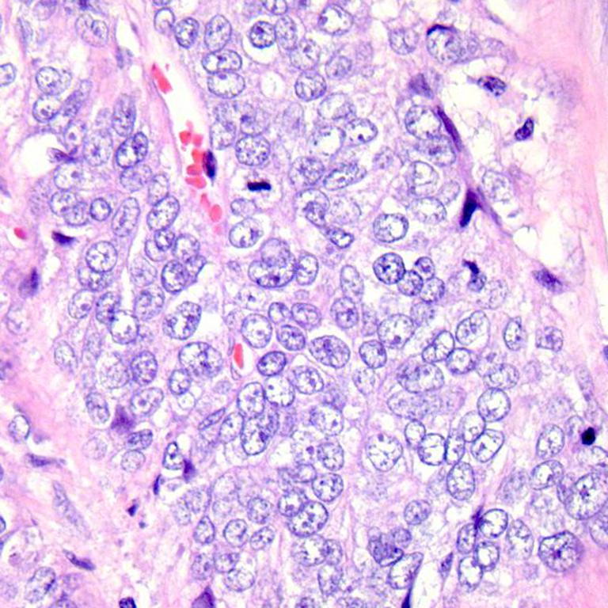

# Fine-tuning Vision Transformer on Lung and Colon Cancer Image Dataset with 🤗 and Tensorflow

Model's Huggingface Link is [here](https://huggingface.co/Guldeniz/vit-base-patch16-224-in21k-lung_and_colon). The source of this [repo](https://www.philschmid.de/image-classification-huggingface-transformers-keras).

This model is a fine-tuned version of google/vit-base-patch16-224-in21k on Lung and Colon Histopathological Images dataset. This dataset can be reach via Kaggle. It achieves the following results on the evaluation set:

* Train Loss: 0.0088

* Train Accuracy: 1.0

* Train Top-3-accuracy: 1.0

* Validation Loss: 0.0084

* Validation Accuracy: 0.9997

* Validation Top-3-accuracy: 1.0

* Epoch: 3

## Model description

The vision transformer model, trained by Google, has been fine-tuned using a lung and colon cancer image dataset consisting of a total of 25,000 images across 5 labels. The obtained results are highly promising, and the model demonstrates the ability to predict the following listed labels.

- colon_aca

- colon_n

- lung_aca

- lung_n

- lung_scc

## Dataset Preview

### Training hyperparameters

The following hyperparameters were used during training:
- optimizer: {'name': 'AdamWeightDecay', 'learning_rate': {'class_name': 'PolynomialDecay', 'config': {'initial_learning_rate': 3e-05, 'decay_steps': 3325, 'end_learning_rate': 0.0, 'power': 1.0, 'cycle': False, 'name': None}}, 'decay': 0.0, 'beta_1': 0.9, 'beta_2': 0.999, 'epsilon': 1e-08, 'amsgrad': False, 'weight_decay_rate': 0.01}
- training_precision: float32

### Training results

| Train Loss | Train Accuracy | Train Top-3-accuracy | Validation Loss | Validation Accuracy | Validation Top-3-accuracy | Epoch |
|:----------:|:--------------:|:--------------------:|:---------------:|:-------------------:|:-------------------------:|:-----:|
| 0.1870     | 0.9784         | 0.9985               | 0.0455          | 0.9987              | 1.0                       | 0     |
| 0.0345     | 0.9972         | 1.0                  | 0.0189          | 0.9995              | 1.0                       | 1     |
| 0.0134     | 1.0            | 1.0                  | 0.0110          | 0.9997              | 1.0                       | 2     |
| 0.0088     | 1.0            | 1.0                  | 0.0084          | 0.9997              | 1.0                       | 3     |

### Framework versions

- Transformers 4.26.1
- TensorFlow 2.12.0
- Datasets 2.10.1
- Tokenizers 0.13.3
